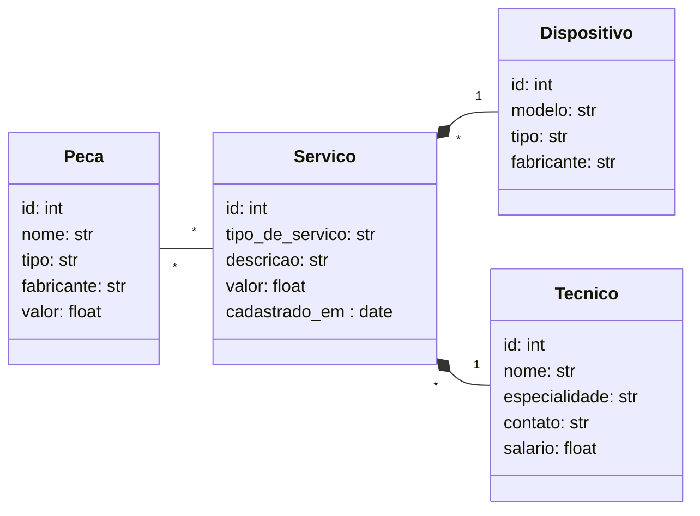

# Sistema de gerenciamento de assistência técnica

## Descrição
O objetivo do projeto é colocar em prática os conceitos aprendidos em aula desenvolvendo uma api REST utilizando FastAPI, SQLModel e um Banco de dados SQLite para realizar o armazenamento persistente dos dados.

## Pré-requisitos

- fastapi[standard]>=0.115.6
-    logging>=0.4.9.6
-    sqlmodel>=0.0.22
-    datetime>=5.5

## Diagrama de Classes UML
O diagrama abaixo mostra a estrutura e os relacionamentos entre as entidades presentes no projeto.

