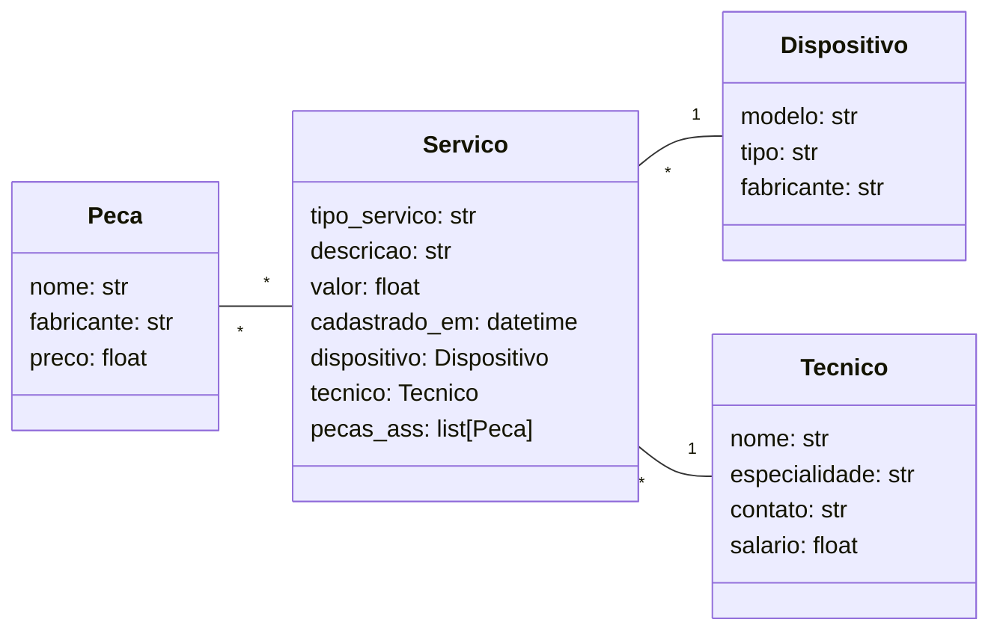

# Sistema de gerenciamento de assistência técnica

## Descrição
O objetivo do projeto é colocar em prática os conceitos aprendidos em aula desenvolvendo uma api REST utilizando FastAPI, e MongoDB para a persistência de dados.

## Pré-requisitos

- "fastapi[standard]>=0.115.8",
- "motor[srv]>=3.7.0",
- "odmantic>=1.0.2",
- "pymongo[srv]>=4.11.1",
- "pyproject-toml>=0.1.0",
- "python-dotenv>=1.0.1",

## Diagrama de Classes UML
O diagrama abaixo mostra a estrutura e os relacionamentos entre as entidades presentes no projeto.

